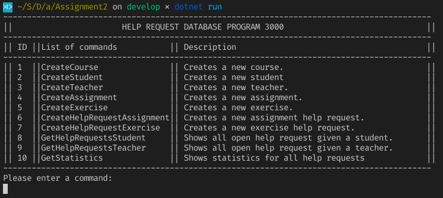

# Assigment 2: StudentHelpRequest
### Group 26
Members

* Anders Fisker: au476572
* Christoffer Nørbjerg: au455948
* David Bendix: au295875
* Kristian Lau Jespersen: au611579

## Setup before running
To easily allow for multiple developers to use their own local database, we used Environment Variables to store the connection string. When using this application you need to either create an Environment Variable with the key `StudentHelperDB` and your connectionstring as the value. Otherwise you can just change the `optionsBuilder.UseSqlServer(***)` in the file ` ButtomLayerPersistanceLogic > StudentHelperContext.cs` to use your own string directly.

After this is done you must run `dotnet ef database update` from your terminal/commandline, or otherwise update the database through Visual Studio.

The `StudentHelperContext` should seed the database with some dummy data.

## Using the Application
When running the application you will be greeted by a prompt showing possible actions to take.

From here you can either write the ID or Name of the command. The application will then prompt for needed information and return to the possible actions after completing the request.

*Because of the time-constraints there have been no focus on error-checking user inputs, so inputting a non-existing ID as a foreign-key will most likely throw errors*